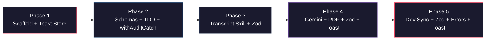

# Quick_yt — Monorepo Execution Plan (v2)

> AI-augmented React Native Expo application for YouTube transcript extraction, Gemini processing, and local dev sync.
>
> **v2 Amendments:** Zod validation layer, standardized error handling with `audit_logs`, Toast/Snackbar + haptics UX.

## Source Specifications

| Spec | Key Contents |
|---|---|
| [01_Vision_and_Plan.md](file:///D:/Quick_yt/01_Vision_and_Plan.md) | Target device (Pixel 8a), UI (RN Paper MD3), state (Zustand + Drizzle), performance constraints |
| [02_Architecture_and_TDD.md](file:///D:/Quick_yt/02_Architecture_and_TDD.md) | Monorepo tree, Drizzle schemas (`videos`, `audit_logs`), Jest mock setup, coverage targets |
| [03_YouTube_Transcript_Skill.md](file:///D:/Quick_yt/03_YouTube_Transcript_Skill.md) | Portable `extract_youtube_transcript` skill, Gemini pipeline, PDF generation via `expo-print` |
| [04_DevSync_MCP_Server.md](file:///D:/Quick_yt/04_DevSync_MCP_Server.md) | Express sync server on port 4000, `DevSyncManager.ts`, backup/restore endpoints |

---

## Cross-Cutting Concerns (New in v2)

These three patterns are woven into every phase where they apply.

### A. Zod Validation Layer

All data crossing a trust boundary (network payloads, file uploads, API requests) must be validated with Zod schemas before processing. This prevents malformed data from propagating silently.

| Boundary | Phase | Zod Schema |
|---|---|---|
| Express multipart upload | 5 | Validates uploaded file is present, has `.db` extension, MIME `application/octet-stream` or `application/x-sqlite3` |
| Gemini API request payload | 4 | Validates `raw_text` is a non-empty string, `systemInstruction` is present, model config is well-formed |
| Transcript extractor input | 3 | Validates `youtube_url` matches YouTube URL pattern, `language_code` is a valid BCP-47 code |

### B. Standardized Error Handling

**Server-side (sync-server):** Every endpoint returns errors in a canonical shape:
```json
{
  "success": false,
  "error": {
    "code": "BACKUP_NOT_FOUND",
    "message": "No backup database exists on the server."
  }
}
```

**Mobile-side:** A unified `withAuditCatch` higher-order wrapper catches all errors from async operations (network, file-system, DB), writes them to `audit_logs` with `status: 'failed'`, and re-throws for the UI layer to handle.

### C. Toast Notifications & Native UX

A global `useToastStore` (Zustand) drives a React Native Paper `<Snackbar>` mounted at the app root. Every user-facing outcome (success, failure, info) calls `useToastStore.getState().show(...)`, which:

1. Sets the Snackbar message and type (`success` | `error` | `info`).
2. Fires `expo-haptics` feedback: `notificationAsync(Success)` on success, `notificationAsync(Error)` on error, `impactAsync(Light)` on info.

---

## Phase 1 — Monorepo Scaffold

**Goal:** Working pnpm monorepo with two packages that install and build cleanly, plus foundational UX stores.

### Tasks

1. **Initialize pnpm workspace root** at `D:\Quick_yt`
   - Create root `package.json` with `"private": true` and workspace scripts
   - Create `pnpm-workspace.yaml` declaring `apps/*` and `tools/*`

2. **Scaffold `apps/mobile`** (Expo SDK 51+)
   - Run `npx -y create-expo-app@latest ./apps/mobile --template blank-typescript`
   - Install production dependencies:
     - `react-native-paper`, `react-native-safe-area-context`, `react-native-vector-icons`
     - `zustand`
     - `drizzle-orm`, `expo-sqlite`
     - `expo-file-system`, `expo-print`, `expo-haptics`, `expo-updates`
     - `markdown-it`
     - **`zod`** *(v2 — validation layer)*
   - Install dev dependencies:
     - `drizzle-kit`
     - `jest`, `@types/jest`, `ts-jest`, `jest-expo`
   - Create directory skeleton: `src/db/`, `src/store/`, `src/skills/`, `src/sync/`, `src/ui/`

3. **Scaffold `tools/sync-server`**
   - Create `tools/sync-server/package.json` with TypeScript + Express
   - Install: `express`, `multer`, `cors`, **`zod`** *(v2)*; dev: `typescript`, `ts-node`, `@types/express`, `@types/multer`, `@types/cors`
   - Create `tools/sync-server/tsconfig.json`
   - Create `tools/sync-server/.dev-backups/` directory (with `.gitkeep`)
   - Create placeholder `tools/sync-server/src/index.ts`
   - Create `Dockerfile`

4. **Scaffold global `useToastStore`** *(v2 — Toast UX)*
   - Create `apps/mobile/src/store/useToastStore.ts`
   - State shape:
     ```typescript
     type ToastType = 'success' | 'error' | 'info';
     interface ToastState {
       visible: boolean;
       message: string;
       type: ToastType;
       show: (message: string, type: ToastType) => void;
       dismiss: () => void;
     }
     ```
   - `show()` sets `visible: true`, message, and type
   - `dismiss()` sets `visible: false`

5. **Create `<GlobalSnackbar>` component** *(v2 — Toast UX)*
   - Create `apps/mobile/src/ui/GlobalSnackbar.tsx`
   - Reads from `useToastStore`
   - Renders React Native Paper `<Snackbar>` with type-driven styling (green/red/blue)
   - On show, fires `expo-haptics`:
     - `success` → `Haptics.notificationAsync(NotificationFeedbackType.Success)`
     - `error` → `Haptics.notificationAsync(NotificationFeedbackType.Error)`
     - `info` → `Haptics.impactAsync(ImpactFeedbackStyle.Light)`
   - Must be mounted at app root (e.g., inside `App.tsx` or root layout)

6. **Verify:** `pnpm install` succeeds from root with no errors.

### Files Created

```text
D:\Quick_yt\
├── package.json
├── pnpm-workspace.yaml
├── .gitignore
├── apps/mobile/
│   ├── src/
│   │   ├── db/
│   │   ├── store/
│   │   │   └── useToastStore.ts        ← v2
│   │   ├── skills/
│   │   ├── sync/
│   │   └── ui/
│   │       └── GlobalSnackbar.tsx      ← v2
│   ├── app.json
│   └── package.json
└── tools/sync-server/
    ├── package.json
    ├── tsconfig.json
    ├── Dockerfile
    ├── .dev-backups/.gitkeep
    └── src/index.ts
```

> [!IMPORTANT]
> **Gate:** `pnpm install` completes successfully. `useToastStore` and `GlobalSnackbar` are in place.

---

## Phase 2 — Drizzle Schemas + TDD Harness

**Goal:** Drizzle schemas pass migration tests under Jest with mocked `expo-sqlite`. All DB operations wrapped with audited error handling.

### Tasks

1. **Implement Drizzle schemas** in `apps/mobile/src/db/schema.ts`
   - `videos` table: `id` (text PK), `url`, `title`, `timestampAdded`, `transcriptRaw`, `markdownReport`, `status` (default `'pending'`)
   - `auditLogs` table: `id` (text PK), `action`, `entityId`, `performanceMs`, `timestamp`, `status`
   - Exactly matching the spec in [02_Architecture_and_TDD.md](file:///D:/Quick_yt/02_Architecture_and_TDD.md#L27-L48)

2. **Create DB helper** in `apps/mobile/src/db/client.ts`
   - Wraps `expo-sqlite` `openDatabaseSync` with Drizzle ORM
   - Exports typed `db` instance and `initDatabase()` function that runs migrations

3. **Create audit log insertion wrapper** in `apps/mobile/src/db/audit.ts`
   - `logAction(action, entityId, performanceMs, status)` — inserts into `audit_logs` with auto-generated ID and timestamp
   - Must have 100% test coverage per spec

4. **Create `withAuditCatch` wrapper** in `apps/mobile/src/db/withAuditCatch.ts` *(v2 — Error Handling)*
   - Higher-order function signature:
     ```typescript
     async function withAuditCatch<T>(
       action: string,
       entityId: string | null,
       fn: () => Promise<T>
     ): Promise<T>
     ```
   - Wraps `fn()` in `try/catch`
   - On success: logs to `audit_logs` with `status: 'success'` and `performanceMs`
   - On failure: logs to `audit_logs` with `status: 'failed'`, captures error message, then re-throws
   - All mobile-side network calls, file-system operations, and DB mutations must use this wrapper

5. **Configure Jest**
   - Create `apps/mobile/jest.config.js` using `jest-expo` preset
   - Create `apps/mobile/jest.setup.js` with mocks for `expo-sqlite` and `expo-file-system` (exactly per spec)
   - Configure `package.json` test script

6. **Write test suites**
   - `apps/mobile/__tests__/db/schema.test.ts`
     - Asserts `videos` and `auditLogs` tables export correct column definitions
     - Asserts `initDatabase()` calls `execAsync` with valid SQL
   - `apps/mobile/__tests__/db/audit.test.ts`
     - Asserts `logAction` inserts correct payload
     - Asserts all fields populated (id, timestamp auto-generated)
     - 100% coverage on insertion wrapper
   - `apps/mobile/__tests__/db/withAuditCatch.test.ts` *(v2)*
     - Asserts successful `fn()` logs `status: 'success'` with measured `performanceMs`
     - Asserts thrown error logs `status: 'failed'` and re-throws the original error
     - Asserts `entityId: null` is handled gracefully

7. **Verify:** `pnpm --filter mobile test` — all tests pass, coverage meets thresholds.

### Files Created/Modified

```text
apps/mobile/
├── jest.config.js
├── jest.setup.js
├── src/db/
│   ├── schema.ts
│   ├── client.ts
│   ├── audit.ts
│   └── withAuditCatch.ts              ← v2
└── __tests__/db/
    ├── schema.test.ts
    ├── audit.test.ts
    └── withAuditCatch.test.ts          ← v2
```

> [!IMPORTANT]
> **Gate:** All Jest tests pass with `expo-sqlite` mocked. 100% coverage on `audit.ts` and `withAuditCatch.ts`.

---

## Phase 3 — YouTube Transcript Skill

**Goal:** Standalone TypeScript module that extracts YouTube captions without paid APIs.

### Tasks

1. **Create skill module** at `apps/mobile/src/skills/transcript/`
   - `extractor.ts` — main module, pure TypeScript, zero React Native dependencies
   - `types.ts` — input/output type definitions per [03_YouTube_Transcript_Skill.md](file:///D:/Quick_yt/03_YouTube_Transcript_Skill.md#L7-L29)
   - `validation.ts` — Zod schemas for input/output *(v2 — Validation)*:
     ```typescript
     const TranscriptInputSchema = z.object({
       youtube_url: z.string().url().regex(/youtube\.com|youtu\.be/),
       language_code: z.string().default('en'),
     });
     ```

2. **Implement extraction logic** in `extractor.ts`
   - `extractTranscript(youtubeUrl: string, languageCode?: string): Promise<TranscriptResult>`
   - Step 0: **Validate input with Zod** — throw typed error on invalid URL *(v2)*
   - Step 1: Fetch raw HTML from YouTube URL via `fetch()`
   - Step 2: Regex parse `ytInitialPlayerResponse = {...}` from HTML
   - Step 3: Navigate JSON to `captions.playerCaptionsTracklistRenderer.captionTracks`
   - Step 4: Find track matching `languageCode` (default `'en'`), fetch its `baseUrl`
   - Step 5: Parse XML caption response into `{ offset_ms, duration_ms, text }[]` segments
   - Step 6: Join segments into `raw_text`, return full `TranscriptResult`

3. **Write tests** in `apps/mobile/__tests__/skills/transcript.test.ts`
   - Mock `global.fetch` with sample YouTube HTML containing `ytInitialPlayerResponse`
   - Mock caption XML response
   - Assert correct extraction of `video_id`, `raw_text`, and `segments` array
   - Assert error handling for missing captions / invalid URLs
   - Assert language code filtering works
   - **Assert Zod rejects malformed URLs** (e.g., `"not-a-url"`, `"https://vimeo.com/123"`) *(v2)*

4. **Verify:** `pnpm --filter mobile test` — all transcript skill tests pass.

### Files Created

```text
apps/mobile/src/skills/transcript/
├── types.ts
├── validation.ts                       ← v2
└── extractor.ts
apps/mobile/__tests__/skills/
└── transcript.test.ts
```

> [!IMPORTANT]
> **Gate:** Transcript extraction tests pass with mocked fetch. Zod rejects invalid inputs. Module has zero RN imports.

---

## Phase 4 — Gemini Pipeline + PDF Generation

**Goal:** Raw transcript → Gemini Markdown report → styled PDF file. All operations validated and audited.

### Tasks

1. **Create Gemini service** at `apps/mobile/src/skills/gemini/`
   - `geminiService.ts` — calls Gemini 1.5 Pro API with the system instruction from the spec
   - Uses `@google/generative-ai` SDK (or direct `fetch` to REST API)
   - System instruction: *"You are a technical analyst..."* — exactly per [03_YouTube_Transcript_Skill.md](file:///D:/Quick_yt/03_YouTube_Transcript_Skill.md#L36)
   - Input: `raw_text` string
   - Output: Markdown string
   - Saves result to `videos.markdownReport` via Drizzle
   - `validation.ts` — **Zod schema for the outbound API payload** *(v2 — Validation)*:
     ```typescript
     const GeminiRequestSchema = z.object({
       contents: z.array(z.object({
         role: z.enum(['user', 'model']),
         parts: z.array(z.object({ text: z.string().min(1) })),
       })).min(1),
       systemInstruction: z.object({
         parts: z.array(z.object({ text: z.string().min(1) })),
       }),
     });
     ```
   - Validate with `GeminiRequestSchema.parse()` **before** calling `fetch()` / SDK
   - On Zod validation failure → log to `audit_logs` with `status: 'failed'`, surface toast *(v2)*

2. **Create PDF generator** at `apps/mobile/src/skills/pdf/`
   - `pdfGenerator.ts`
   - Uses `markdown-it` to convert Markdown → HTML
   - Injects Material 3 inspired CSS stylesheet into the HTML string
   - Calls `expo-print.printToFileAsync({ html })` to generate PDF
   - Returns the PDF file URI

3. **Create processing pipeline** at `apps/mobile/src/skills/pipeline.ts`
   - Orchestrates: extract transcript → call Gemini → generate PDF → update DB → log audit
   - Updates `videos.status` through lifecycle: `pending` → `transcribing` → `processing` → `generating_pdf` → `complete`
   - **Every stage wrapped with `withAuditCatch`** — failures write `status: 'failed'` to `audit_logs` and stop the pipeline *(v2 — Error Handling)*
   - **On pipeline completion:** trigger `useToastStore.getState().show('Report generated', 'success')` *(v2 — Toast UX)*
   - **On pipeline failure:** trigger `useToastStore.getState().show('Pipeline failed: ...', 'error')` *(v2 — Toast UX)*
   - Haptic feedback fires automatically via `GlobalSnackbar` *(v2)*

4. **Write tests**
   - `apps/mobile/__tests__/skills/gemini.test.ts`
     - Mock Gemini API response
     - Assert system instruction is correctly passed
     - Assert Markdown output stored in DB
     - **Assert Zod rejects payload with empty `raw_text`** *(v2)*
     - **Assert Zod rejects payload with missing `systemInstruction`** *(v2)*
   - `apps/mobile/__tests__/skills/pdf.test.ts`
     - Mock `expo-print` and `markdown-it`
     - Assert HTML includes MD3 stylesheet
     - Assert `printToFileAsync` called with correct HTML
   - `apps/mobile/__tests__/skills/pipeline.test.ts`
     - Mock all sub-services
     - Assert status transitions are correct
     - Assert audit logs created at each stage
     - **Assert a thrown error at any stage writes `status: 'failed'` to `audit_logs`** *(v2)*
     - **Assert `useToastStore.show` is called with correct type on success and failure** *(v2)*

5. **Verify:** All pipeline tests pass.

### Files Created

```text
apps/mobile/src/skills/
├── gemini/
│   ├── geminiService.ts
│   └── validation.ts                   ← v2
├── pdf/
│   ├── pdfGenerator.ts
│   └── styles.ts
└── pipeline.ts
apps/mobile/__tests__/skills/
├── gemini.test.ts
├── pdf.test.ts
└── pipeline.test.ts
```

> [!IMPORTANT]
> **Gate:** All Gemini + PDF tests pass. Zod validates outbound payloads. `withAuditCatch` logs all failures. Toast fires on completion/error.

---

## Phase 5 — Local Dev Sync Workflow

**Goal:** Bidirectional SQLite sync between Expo app and Windows Express server. All uploads validated. All responses standardized.

### Tasks

1. **Define standardized error response schema** *(v2 — Error Handling)*
   - Create `tools/sync-server/src/errors.ts`
   - Canonical error shape:
     ```typescript
     interface ApiErrorResponse {
       success: false;
       error: {
         code: string;   // e.g., 'BACKUP_NOT_FOUND', 'INVALID_FILE_TYPE', 'UPLOAD_FAILED'
         message: string;
       };
     }
     interface ApiSuccessResponse<T = unknown> {
       success: true;
       data?: T;
       message?: string;
     }
     ```
   - All endpoints must return one of these two shapes — no exceptions
   - Error codes:
     | Code | Meaning |
     |---|---|
     | `INVALID_FILE_TYPE` | Uploaded file is not a `.db` SQLite file |
     | `NO_FILE_UPLOADED` | Multipart request missing `database` field |
     | `BACKUP_NOT_FOUND` | No backup exists on server for restore |
     | `UPLOAD_FAILED` | Server-side write error |
     | `INTERNAL_ERROR` | Unexpected server error |

2. **Create Zod upload validation middleware** *(v2 — Validation)*
   - Create `tools/sync-server/src/validation.ts`
   - Zod schema for the uploaded file:
     ```typescript
     const UploadFileSchema = z.object({
       originalname: z.string().endsWith('.db'),
       mimetype: z.enum([
         'application/octet-stream',
         'application/x-sqlite3',
         'application/vnd.sqlite3',
       ]),
     });
     ```
   - Express middleware that runs after Multer, validates `req.file` against schema
   - On failure: deletes the uploaded temp file, returns `{ success: false, error: { code: 'INVALID_FILE_TYPE', ... } }`

3. **Implement Express sync server** in `tools/sync-server/src/index.ts`
   - Based on [04_DevSync_MCP_Server.md](file:///D:/Quick_yt/04_DevSync_MCP_Server.md#L11-L45)
   - `POST /api/sync/backup`
     - Multer accepts upload → Zod validates file → saves as `app_backup.db`
     - Returns `{ success: true, message: 'Database backed up to Windows PC.' }`
     - On validation failure → `{ success: false, error: { code: 'INVALID_FILE_TYPE', ... } }`
     - On no file → `{ success: false, error: { code: 'NO_FILE_UPLOADED', ... } }`
   - `GET /api/sync/restore`
     - Serves the backed-up DB file, or returns `{ success: false, error: { code: 'BACKUP_NOT_FOUND', ... } }` (status 404)
   - `GET /api/sync/status` — health check, returns `{ success: true, message: 'Sync server is running.' }`
   - **Global error handler** catches uncaught errors, returns `{ success: false, error: { code: 'INTERNAL_ERROR', ... } }`
   - Listens on port 4000, CORS enabled

4. **Implement `DevSyncManager`** in `apps/mobile/src/sync/DevSyncManager.ts`
   - Based on [04_DevSync_MCP_Server.md](file:///D:/Quick_yt/04_DevSync_MCP_Server.md#L48-L69)
   - `backupToPC()` — uses `FileSystem.uploadAsync` to push `app.db` to sync server
   - `restoreFromPC()` — uses `FileSystem.downloadAsync` to pull DB, then `Updates.reloadAsync()`
   - Configurable `PC_IP` constant
   - **Both functions wrapped with `withAuditCatch`** — failures log `status: 'failed'` *(v2 — Error Handling)*
   - **On success:** `useToastStore.getState().show('Backup complete', 'success')` *(v2 — Toast UX)*
   - **On failure:** `useToastStore.getState().show('Sync failed: ...', 'error')` *(v2 — Toast UX)*
   - Haptic feedback fires automatically via `GlobalSnackbar` *(v2)*

5. **Write tests**
   - `apps/mobile/__tests__/sync/devSyncManager.test.ts`
     - Mock `expo-file-system` (`uploadAsync`, `downloadAsync`)
     - Mock `expo-updates` (`reloadAsync`)
     - Assert `backupToPC` calls `uploadAsync` with correct URL, path, and multipart config
     - Assert `restoreFromPC` calls `downloadAsync` then `reloadAsync`
     - Assert payload formatting is correct (100% coverage per spec)
     - **Assert `withAuditCatch` logs `status: 'failed'` on network error** *(v2)*
     - **Assert `useToastStore.show` called with `'success'` / `'error'` appropriately** *(v2)*
   - `tools/sync-server/__tests__/server.test.ts`
     - Use `supertest` to test Express routes
     - Assert backup upload saves file and returns `{ success: true, ... }`
     - Assert restore returns file or `{ success: false, error: { code: 'BACKUP_NOT_FOUND', ... } }`
     - **Assert uploading a `.txt` file returns `{ success: false, error: { code: 'INVALID_FILE_TYPE', ... } }`** *(v2)*
     - **Assert uploading with no file returns `{ success: false, error: { code: 'NO_FILE_UPLOADED', ... } }`** *(v2)*
     - **Assert all error responses conform to the canonical `ApiErrorResponse` shape** *(v2)*

6. **Verify:** All sync tests pass. Server starts on port 4000.

### Files Created/Modified

```text
tools/sync-server/src/
├── index.ts
├── errors.ts                           ← v2
└── validation.ts                       ← v2
tools/sync-server/__tests__/
└── server.test.ts
apps/mobile/src/sync/
└── DevSyncManager.ts
apps/mobile/__tests__/sync/
└── devSyncManager.test.ts
```

> [!IMPORTANT]
> **Gate:** 100% coverage on `DevSyncManager` payload formatting. Zod rejects non-`.db` uploads. All responses conform to canonical shape. Toast + haptics fire on success/failure.

---

## Dependency Summary

| Package | Location | Purpose |
|---|---|---|
| `react-native-paper` | apps/mobile | Material Design 3 UI + Snackbar |
| `zustand` | apps/mobile | Ephemeral UI state + `useToastStore` |
| `drizzle-orm` | apps/mobile | Typed SQLite ORM |
| `expo-sqlite` | apps/mobile | Local SQLite database |
| `expo-file-system` | apps/mobile | File upload/download for sync |
| `expo-print` | apps/mobile | Markdown → PDF generation |
| `expo-haptics` | apps/mobile | Haptic feedback on toast events |
| `expo-updates` | apps/mobile | Hot reload after DB restore |
| `markdown-it` | apps/mobile | Markdown → HTML conversion |
| `@google/generative-ai` | apps/mobile | Gemini 1.5 Pro API |
| **`zod`** | **apps/mobile + tools/sync-server** | **Runtime schema validation** *(v2)* |
| `jest-expo` | apps/mobile (dev) | Test runner |
| `drizzle-kit` | apps/mobile (dev) | Migration tooling |
| `express` | tools/sync-server | HTTP server |
| `multer` | tools/sync-server | Multipart file upload |
| `cors` | tools/sync-server | Cross-origin support |
| `supertest` | tools/sync-server (dev) | HTTP route testing |

---

## Risk Considerations

> [!WARNING]
> - **YouTube scraping fragility:** `ytInitialPlayerResponse` format may change. The extractor needs defensive parsing with clear error messages.
> - **Gemini API key security:** Must be stored in environment variables / Expo secure config, never hardcoded.
> - **Network dependency:** The sync workflow requires the device and PC to be on the same LAN. The app should handle connection failures gracefully via `withAuditCatch` + toast.
> - **expo-sqlite path:** The exact path `${documentDirectory}SQLite/app.db` must be validated on Expo SDK 51+.
> - **Zod version parity:** Both `apps/mobile` and `tools/sync-server` must pin the same major version of `zod` to avoid schema incompatibilities if shared types are introduced later.

---

## v2 Amendment Traceability Matrix

| Amendment | Where Applied |
|---|---|
| **Zod added to deps** | Phase 1 (both packages) |
| **Zod validates Express upload** | Phase 5 — `tools/sync-server/src/validation.ts`, middleware after Multer |
| **Zod validates Gemini payload** | Phase 4 — `apps/mobile/src/skills/gemini/validation.ts`, before `fetch()` |
| **Zod validates transcript input** | Phase 3 — `apps/mobile/src/skills/transcript/validation.ts` |
| **Standardized JSON error schema** | Phase 5 — `tools/sync-server/src/errors.ts`, all endpoints |
| **`withAuditCatch` wrapper** | Phase 2 (defined + tested), Phase 4 (pipeline stages), Phase 5 (DevSyncManager) |
| **`useToastStore` scaffolded** | Phase 1 — `apps/mobile/src/store/useToastStore.ts` |
| **`GlobalSnackbar` component** | Phase 1 — `apps/mobile/src/ui/GlobalSnackbar.tsx` |
| **Toast on pipeline complete/fail** | Phase 4 — `pipeline.ts` calls `useToastStore.show()` |
| **Toast on sync success/fail** | Phase 5 — `DevSyncManager.ts` calls `useToastStore.show()` |
| **Haptics coupled to Snackbar** | Phase 1 — `GlobalSnackbar.tsx` fires `expo-haptics` on every show |

---

## Execution Order



Each phase gate requires all tests to pass before advancing to the next phase.
